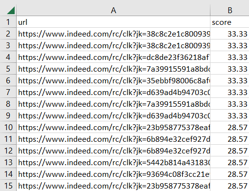

# Auto Job Finder - Indeed

Tired of looking through hundreds of jobs to find ones with a good fit? Let a computer do it for you, just like how recruiters screen applicants! This program combs through pages of Indeed search results to find job listings that fit your skills, and can also reject ones that have keywords you don't want.

## Instructions
1. Download code
2. Enter keywords and badwords in their respective text files (see provided examples). This also supports HTML tags (in badwords I have one for no relocation).
3. Open Indeed on your computer and search for the job you want (ex. "Hardware Engineer") and paste the link for the search results into the first parameter of ```data = s.scrape(``` in main.py. Truncate the link after "start=" (see provided example)
4. Download Selenium Webdriver for your browser and version and put it in the same folder as main.py
6. Run the program. Do not close the automatically opened browser. By default, the bot will save 1000 jobs, but you can adjust this to be lower or greater in search.py. 
7. View the jobs the bot found, sorted by keyword match % in out.csv
